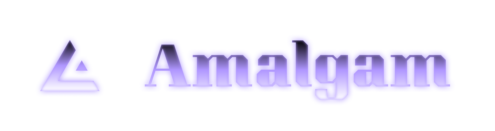

  ## 

  
  
  
  
  
  
  
  
   
  
  
  
  
   
  
  
  
  
  
  AVX2 may be faster than SSE2 though not all CPUs support it (`Steam > Help > System Information > Processor Information > AVX2`). Freetype uses freetype as the text rasterizer and includes some custom fonts, which results in better looking text but larger DLL sizes. PDBs are for developer use. 
    
  If nightly.link is down or can't be accessed, you can still download through [GitHub](https://github.com/TheGameEnhancer2004/Amalgam-v2/actions) with an account. 
    
  Textmode doesnt fully make the game textmode. You need to preload [TextModeTF2](https://github.com/TheGameEnhancer2004/TextmodeTF2) module to make the game textmode.

  ##
  
  Read about the original Amalgam documentation and features [here](https://github.com/rei-2/Amalgam/wiki). Note: This is **TheGameEnhancer2004's fork** with additional features and changes over the original rei-2 version. 

##

### 
Changes in this version

- **General**
  - Nav engine
    - Pathfinding tool used by `Navbot` and such
    - Requires nav meshes (.nav files) to run
  - Navbot
    - Utilizes `Nav engine` to complete goals specified by navbot preferences
    - Also includes misc features: `Auto scope`, `Force weapon` and `Recharge DT`
  - Followbot
    - Automatically follows specified targets
    - Utilizes `Nav engine` if specified
  - Namedpipe
    - Implements communication with [neptune botpanel](https://github.com/mlemlody/neptune)
    - Sends client info such as localplayer's health, class, server name and map name.
  - Textmode builds ([TextModeTF2](https://github.com/TheGameEnhancer2004/TextmodeTF2) compatibility)
    - Disables game visuals to decrease CPU usage
    - Enables `Namedpipe`
    - Enables some additional hooks to avoid crashes (currently WIP)
- **Misc**
  - Backtrack to crosshair (Performs `tick_count` manipulations on manual shots allowing to hit backtrack records)
  - Auto engineer building repair/upgrade
  - Auto class select
  - Changes to auto queue allowing for more customization:
    - Search community servers
    - Auto re-queue (if kicked, players less/greater than <...>)
    - MannUp queue
  - Cathook's autoitem system (Automatically equip weapons, hats, noisemakers. Currently glitchy on textmode builds)
  - '-insecure' bypass (Bypasses client-side checks allowing to join vac protected servers. `Valve allows cheats` in menu)
  - Added weapon shooting sound break exploit (Switches weapons back and forth every attack avoiding shoot sound. Soldier only)
  - MvM:
    - Buybot
    - Auto ready up
  - Ping reducer now uses target ping value instead of `cl_cmdrate`
  - Added option for auto detonation to wait for sufficient damage before detonating (Not recommended to use it as it's far from being perfect)
  - 360 aim FOV and allow aiming with active ui
  - Spam features:
    - Voice command spam
    - Chat spam
    - Voice chat spam
    - Achievement spam
    - Vote spam
  - New commands (all commands now use `cat_` prefix):
    - cat_criteria: Loads casual criteria
    - cat_abandon: Abandons current match
    - cat_load: Loads specified config
    - cat_path_to: Walks to given xyz coordinates using `Nav engine`
    - cat_save_nav_mesh: Saves currenly loaded nav mesh into the .nav file located at `Amalgam\Nav`
    - cat_ignore: Adds/Removes specified tag for given steamid32
    - cat_dumpnames: Dumps names of players present on currently connected server
    - cat_rent_item: Automatically rents an item with given item definition index
    - cat_achievement_unlock: Unlocks all in-game achievements
- **Visual**
  - Added option to turn on weapon killstreak count
  - Esp, glow and chams:
    - Min and max draw/render distance
    - Distance to alpha (Transparency changes depending on current distance and minmax values of render distance)
  - Crithack, Ticks and Spectator List indicator changes
  - Nav engine:
    - Indicator: Shows info about `Navbot`'s current goal
    - Draw: Renders path, blacklisted nodes and local area
- **Other**
  - Added debug var automatic loading (`Load debug settings` in menu)
  - Auto accept item drops now removes the notification from ui aswell
  - Changed loading process allowing for early injection (e.g. Xenos manual launch)
  - Added signature generator for crash log call trace
  - Fixed menu tooltips not accounting for newlines
